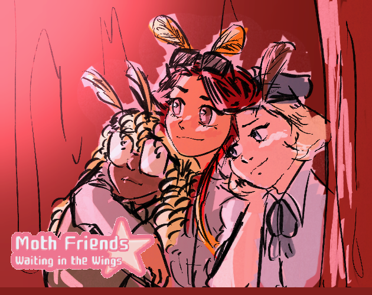

# Moth Friends: Waiting in the Wings

## Credits

### Project Leads
- Stephen S.: Overall Team Lead, Art Team Lead

### Artists
- Laura B.
    - Environment Concept Art
- Alex H.
    - Environment Concept Art
- Jake H.
    - Character Concept Art
- Hannah W.
    - UI/UX Design and Art Creation
- Kacy W.
    - Story Writing

### Programmers
- Jared B.
    - Asset Implementation
    - Collision
    - Cross Team Support
- Carson C.
    - Score System
    - Health System
    - Dialogue System
    - Cross Team Support
- David J.
    - Special Ability Programming
    - Main Character Programming
- Sagar P.
    - UI/UX Implementation
    - Scene Management
    - Level Design and Implementation
- Thomas S.
    - Programming Team Lead
    - Enemy Attack Pattern Programming
- Kacy W.
    - Asset Implementation

### Sound Designers
- Lucien B.
    - SFX
    - Boss 1 Song
- Thomas L.
    - Music Composition

### Playtesters
- Siya S.

## Requirements for Contributing

Pre-Commit Hooks: CSharpier -- A Prettier Inspired CSharp Formatter
- Install `pre-commit` via your method of choice.
    - [pre-commit Installation Instructions](https://pre-commit.com/#install)
- Install`pre-commit` hooks with the command: `pre-commit install`
- Verify pre-commit hook installation with the command `pre-commit run --all-files`
